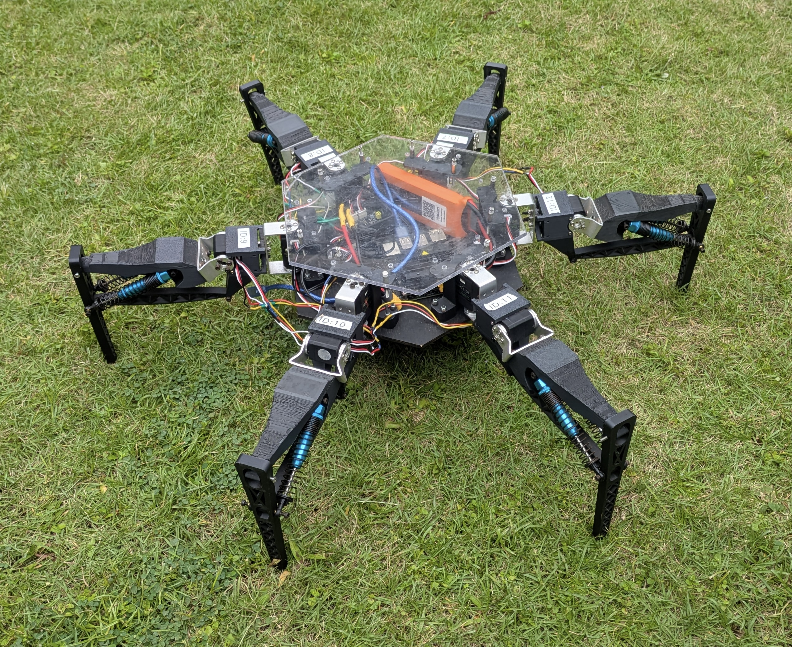

# Spiderbot MJLab



This repository contains the simulation and learning codebase for the paper
**Design and Development of an Open-Source Energy-Efficient Hexapod Research
Platform**.

- Paper: TODO
- Project page: TODO

The code is built as a Spiderbot-focused fork of
[mjlab](https://github.com/mujocolab/mjlab). It adds custom hexapod robot assets,
velocity-tracking tasks, and sim2sim XMLs for a closed-loop linkage Spiderbot
platform.

The original MJLab README is preserved as [README_mjlab.md](README_mjlab.md).

## What's Included

- `Spiderbot`: the main closed-loop hexapod with equality constraints and tendon
  spring elements.
- `Spider3d`: a simpler 3-DoF spider-style model used for development and
  comparisons.
- Flat and rough velocity-tracking tasks for both robots.
- Spiderbot-specific terrain, action, contact, and constraint tuning.
- A standalone `sim2sim` MuJoCo XML for checking trained policies outside the
  MJLab task stack.

## Install

MJLab training requires an NVIDIA GPU. The recommended setup uses
[uv](https://docs.astral.sh/uv/):

```bash
uv sync
```

If `uv` is not already installed:

```bash
curl -LsSf https://astral.sh/uv/install.sh | UV_INSTALL_DIR="$HOME/.local/bin" sh
```

## Tasks

The added task IDs are:

```text
Mjlab-Velocity-Flat-Spiderbot
Mjlab-Velocity-Rough-Spiderbot
Mjlab-Velocity-Flat-Spider3d
Mjlab-Velocity-Rough-Spider3d
```

## Quick Checks

Run Spiderbot with zero actions:

```bash
uv run play Mjlab-Velocity-Flat-Spiderbot --agent zero
```

Run Spiderbot with random actions:

```bash
uv run play Mjlab-Velocity-Flat-Spiderbot --agent random
```

For rough terrain:

```bash
uv run play Mjlab-Velocity-Rough-Spiderbot --agent zero
uv run play Mjlab-Velocity-Rough-Spiderbot --agent random
```

## Training

Train Spiderbot on rough terrain:

```bash
uv run train Mjlab-Velocity-Rough-Spiderbot --env.scene.num-envs 4096
```

For a smaller first run:

```bash
uv run train Mjlab-Velocity-Rough-Spiderbot --env.scene.num-envs 1024
```

Train on flat terrain:

```bash
uv run train Mjlab-Velocity-Flat-Spiderbot --env.scene.num-envs 4096
```

## Sim2sim

The `sim2sim/` directory contains a standalone MuJoCo setup for Spiderbot policy
validation. The main XML is:

```text
sim2sim/xmls/Hexapod_test.xml
```

This XML has been tuned to match the current Spiderbot MJLab configuration on
the key stability-sensitive settings: actuator gains, foot contact, equality
constraints, tendon damping, and solver iterations.

## Tests

Run the velocity task smoke tests:

```bash
uv run pytest tests/test_velocity_task.py
```

## Acknowledgements

This project builds on MJLab, MuJoCo, and MuJoCo Warp. See
[README_mjlab.md](README_mjlab.md) for the original MJLab project description,
documentation links, and upstream usage notes.
